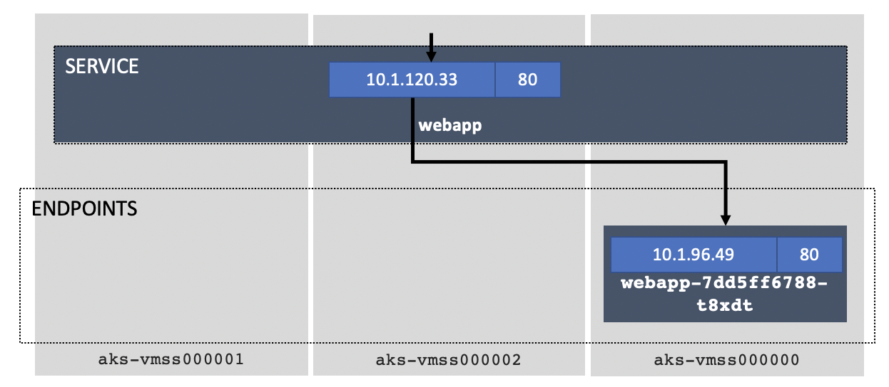
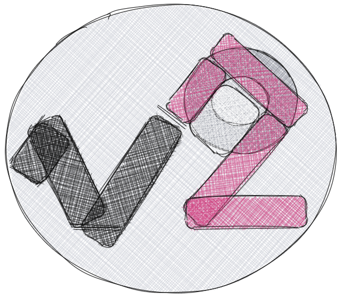

# K8S 101 Challenge

This is a series of exercices and hands on in order to get into Kubernetes and start working on NGINX Ingress Controller.

## Capture the Flag
Of course, if there is a challenge, there will be a winner (I did not mention anything about a price though)!
Please go create a user account on [Capture the K8S Flag](http://ctfd.f5demolab.org) and start playing.

But we will never leave you alone:
- cheat-sheet: https://github.com/fchmainy/k8s-trainings-101/raw/main/doc/k8s-101-cheatsheet.pdf
- flow diagram: https://github.com/fchmainy/k8s-trainings-101/raw/main/doc/tshoot%20k8s%20pod%20deployment.pdf

For every lab you will find a series of questions that will give you coins. You can ask for hints in exchange of some coins.

---

## Lab0 - Getting familiar with your K8S Cluster
### Description

> Understanding the main components of a K8S Clutser, node types, basic networking, meaning and relationship between Services, Endpoints and Pods.

**Useful commands**:

    kubectl cluster-info
    kubectl get nodes
    kubectl get namespaces
    kubectl get service -n *namespace*
    kubectl get endpoints -n *namespace*
    kubectl get pods -n *namespace*

---

## Lab1 - Build and deploy your first application
### Description
	- what is Container and why container registries are important?
	- managing secrets
	- basic git commands
	- deploy your application

### Tasks
if you don't have a gitlab.com (free) account, please create one. We will use it as a Source Code Management but mostly here as a private container registry.
When you are done:
 - create a new project
 - create a new Deployment token Username and Password (Settings > Repository > Deploy Tokens). Keep them safetly, we will use them in the whole labs.
 - Go to container registry (Package & Registry > Container Registry)
Gitlab is giving you the commands to make docker logged in into your registry along with the 2 needed commands to build and push your container image into your registry. We will use them very soon

<pre>
docker login <i>registry.gitlab.com</i> -u <i>yourDeployTokenUsername</i>
</pre>
 
Now, let's download the application code:

make sure your append a correct tag and version at the end of the build and push commands Gitlab gave you previously.
<pre>
git clone https://github.com/fchmainy/k8s-trainings-101.git
cd k8s-trainings-101/v1/
docker build -t registry.gitlab.com<i>/f.chmainy/mygitrepo</i><b>/webapp:v1</b> .
docker push registry.gitlab.com<i>/f.chmainy/mygitrepo</i><b>/webapp:v1</b>
</pre>

Verify the v1 of the webapp container image is on your registry.

We have prepared a model for the kubernetes manifest in order to help you create the service and the deployment. Please modify so it matches your requirements.

Now you can deploy this application in your kubernetes cluster (check the following challenges in ctfd):
**TASKS:** (check corresponding flags on CTFD):
-  create a namespace called **frontns**
- create a docker-registry kubernetes secret on registry.gitlab.com using your deploy tokens.
- deploy the v1_webapp_k8s_manifest.yaml in your **frontns** namespace (verify the manifest file content so it matches your ecosystem).

> :warning: Don't forget to go check on [CTFD](http://ctfd.f5demolab.org) if there are any challenges and questions for this section

### Useful commands

<pre>
docker login
docker build
docker push
kubectl create ns
kubectl create secret
kubectl apply
</pre>

---

## Lab2 - Make application accessible from outside
### Description:
	- Look into your app
	- Expose your application
	- Find the instructor container registry Deploy Token Username and Password
	- Deploy the ingress controller and create the Ingress Resource

### Tasks
Understand how your application works:

<pre>
❯ kubectl get svc -n frontns -l tier=front -l version=v1
NAME     TYPE        CLUSTER-IP    EXTERNAL-IP   PORT(S)   AGE
webapp   ClusterIP   <b>10.1.120.33</b>   none        80/TCP    11m

❯ kubectl describe svc webapp -n frontns
Name:              webapp
Namespace:         frontns
Labels:            tier=front
                   version=v1
Annotations:       <none>
Selector:          app=webapp,version=v1
Type:              ClusterIP
IP:                <b>10.1.120.33</b>
Port:              <unset>  <b>80/TCP</b>
TargetPort:        <b>80/TCP</b>
Endpoints:         <b>10.1.96.49:80</b>
Session Affinity:  None
Events:            <none>

❯ kubectl get ep -n frontns
NAME     ENDPOINTS       AGE
webapp   <b>10.1.96.49:80</b>   13m

❯ kubectl get pods -n frontns -o wide
NAME                      READY   STATUS    RESTARTS   AGE   IP           NODE                                NOMINATED NODE   READINESS GATES
webapp-7dd5ff6788-t8xdt   1/1     Running   0          11m  <b> 10.1.96.49</b>   vmss000000   <none>           <none>
</pre>

You can check how it works by running a debug networking pod (praqma/multitool)
<pre>
kubectl create ns <i>debug</i>
kubectl run multitool --image=praqma/network-multitool -n <i>debug</i>
kubectl exec -it multitool -n <i>debug</i> -- bash

bash-5.0# curl webapp.frontns -v
*   Trying <b>10.1.120.33:80</b>...
* Connected to <b>webapp.frontns</b> (<b>10.1.120.33) port 80</b> (#0)
</pre>

There are many ways to make your application accessible from the outside, first and foremost the **port-forward** which is mostly used for troubleshooting as it is not permanent.
Port Forwarding can be applied on the service, deployment, pods... it really depends what you want to debug:

**TASKS:** (check corresponding flags on CTFD):
- create a port-forward to your **webapp deployment** redirecting TCP port 5000 to TCP/80.
- curl http://127.0.0.1:5000

You should access the webapp (v1) web page:

	

You will find, on the presented V1 web page, the instructor gitlab Deploy Token Username and Password. Keep it safely, you will need it for the next tasks.

Note:
<i>You can also expose your application using the expose service object and access your application via a NodePort. This is a permanent change (until you explicitly remove it) so we won't use it here as we prefer using an Ingress service. Expose is presented here: https://kubernetes.io/docs/tutorials/stateless-application/expose-external-ip-address/</i>

> :warning: Don't forget to go check on [CTFD](http://ctfd.f5demolab.org) if there are any challenges and questions for this section

### Useful commands

<pre>
kubectl port-forward 
</pre>

## Lab3 - Manage versioning of your application with Ingress
### Description
	- Deploy an Ingress Resource to access the (v1) application
	- Deploy the version 2 (v2) of the web application
	- Deployment Strategies (Canary Realease, A/B Testing...)

In a real life the testing, validation, building and release should be automated as part of a CI/CD pipeline. We are gogoing to manually detail part of this process to understand the advanced routing capabilities of our NGINX Ingress services in delivering applications.

### Install NGINX Ingress Controller
To access your kubernetes services from the outside world, the common way is to use an Ingress service.

:warning The Ingress Controller has to be deployed in any namespace disctinct from the application services. The Ingress Resources are however deployed in the app services namespaces.

**TASKS** (check corresponding flags on CTFD):
Using the instructor private registry deployment token username and password, you should create a new namespace called **"ingress"**, create a docker-registry secret and deploy into the ingress namespace the following container image:
<pre>
	<b>registry.gitlab.com/f.chmainy/nginx:v1.10.0</b>
</pre>

There are multiple ways we can install the NGINX Kubernetes Ingress Controller:
- [using manifests](https://docs.nginx.com/nginx-ingress-controller/installation/installation-with-manifests/)
- [using helm](https://docs.nginx.com/nginx-ingress-controller/installation/installation-with-helm/)
- [using operator](https://docs.nginx.com/nginx-ingress-controller/installation/installation-with-operator/)

here we will use the helm deployment mode as it is the simpler way to install all the components (Service Accounts, CRDs,...).

<pre>
<b>helm repo list</b>
Error: no repositories to show

<b>helm repo add nginx-stable https://helm.nginx.com/stable</b>
"nginx-stable" has been added to your repositories

<b>helm repo update</b>
Hang tight while we grab the latest from your chart repositories...
...Successfully got an update from the "nginx-stable" chart repository
Update Complete. ⎈Happy Helming!⎈

<b>helm repo list</b>
NAME            URL
nginx-stable    https://helm.nginx.com/stable
</pre>

The Ingress Controller can be deployed in any namespace disctinct from the application services. The Ingress Resources are however deployed in the app services namespaces.

**TASKS** (check corresponding flags on CTFD):
- create a namespace called **ingress**
- create a docker-registry secret in the **ingress** namespace using the instructor deploy username/password tokens.

Now, we are going to deploy the NGINX Plus Ingress and all of the required components in a single command:
<pre>
helm install nginx-ingress nginx-stable/nginx-ingress \
--namespace <b>ingress</b> \
--set controller.kind=<b>deployment</b> \
--set controller.replicaCount=<b>2</b> \
--set controller.nginxplus=<b>true</b> \
--set controller.appprotect.enable=<b>true</b> \
--set controller.image.repository=<b>registry.gitlab.com/f.chmainy/nginx</b> \
--set controller.image.tag=<b>v1.10.0</b> \
--set controller.service.type=NodePort \
--set controller.service.httpPort.nodePort=30274 \
--set controller.service.httpsPort.nodePort=30275 \
--set controller.serviceAccount.imagePullSecretName=<b>regcred</b> \
--set controller.ingressClass=<b>ingressclass1</b>
</pre>

### Ingress Resource
Next step is creating an Ingress Resource to access your application.
You can inspire from the example on the official [NGINX INC Github Repository](https://github.com/nginxinc/kubernetes-ingress/tree/master/examples-of-custom-resources/basic-configuration)

### Access the v1 web application
In the web application namespace (frontns), we should now deploy the Ingress Resource matching the Ingress Class specified when we deployed the Ingress Controller:
 
<pre>
apiVersion: k8s.nginx.org/v1
kind: VirtualServer
metadata:
  name: k8s101ingress
spec:
  ingressClassName: ingressclass1
  host: www.mycompany.com
  upstreams:
  - name: v1
    service: webapp
    port: 80
  routes:
  - path: /
    action:
      proxy:
        upstream: v1
</pre>

you can now access your v1 application using your web browser at http://www.mycompany.com:30274
Note:
<i>if you are using the UDF blueprint, the www.company.com fqdn should already be registered in the jumpHost hosts file.</i>

### Build and deploy the version 2 of your application
A new version of our application has been developed and ready to be released. 
First, build and push the v2 front container image into your private container image registry.
<pre>
<b>
cd ../v2
docker build -t registry.gitlab.com/f.chmainy/toremove/webapp:v2 .
docker push registry.gitlab.com/f.chmainy/toremove/webapp:v2
</b>
</pre>

Then, you can use the kubernetes manifest of the application to deploy the Ingress Resource.
<pre>
<b>kubectl apply -f v2/front/v2_webapp_k8s_manifest.yaml -n frontns</b>
service/webappi-v2-svc configured
deployment.apps/webapp-v2-dep configured
</pre>

        

Note: In a large scale cluster, you probably won't have a clear mapping of services names, deployments, endpoints and pods, this is why labels could be very useful:

<pre>
<b>kubectl get svc --all-namespaces -l application=k8s101,version=v1,tier=front</b>
NAMESPACE   NAME     TYPE        CLUSTER-IP       EXTERNAL-IP   PORT(S)   AGE
frontns     webapp   ClusterIP   10.103.125.244   <none>        80/TCP    53m

<b>kubectl get svc --all-namespaces -l application=k8s101,version=v2,tier=front</b>
NAMESPACE   NAME             TYPE        CLUSTER-IP      EXTERNAL-IP   PORT(S)   AGE
frontns     webappi-v2-svc   ClusterIP   10.110.131.55   <none>        80/TCP    56m
</pre>

There are multiple strategies to choose when releasing a new application version:
- A/B Testing
- Canary Testing
- Blue/Green

some external documentation: https://docs.flagger.app/usage/deployment-strategies

It comes down to what do you want to achieve, who/what is testing the application?...
You have multiple example you can inspire from at: https://github.com/nginxinc/kubernetes-ingress/tree/master/examples-of-custom-resources

#### A/B Testing
Here, we want to split part of the traffic (%) to the new version so we can validate and measure the proper functioning of the new version without impacting too many customers if there were any issue in the code.
Here we are doing a 80% to v1 and 20% to v2, in real life the cursor would be progressively moving out to v2 until final approval.

[link to documentation](https://docs.nginx.com/nginx-ingress-controller/configuration/virtualserver-and-virtualserverroute-resources/#split)

<pre>
apiVersion: k8s.nginx.org/v1
kind: VirtualServer
metadata:
  name: k8s101ingress
spec:
  ingressClassName: ingressclass1
  host: www.mycompany.com
  upstreams:
  - name: v1
    service: webapp
    port: 80
  - name: v2
    service: webapp-v2-svc
    port: 80
  routes:
  - path: /
    splits:
    - weight: <b>80</b>
      action:
        pass: v1
    - weight: <b>20</b>
      action:
        pass: v2
</pre>

#### Canary testing
In this scenario, we are directing traffic to the new version only for specific key users (devs, test users...) by steering only if a specific header or cookie is provided.

[link to documentation](https://docs.nginx.com/nginx-ingress-controller/configuration/virtualserver-and-virtualserverroute-resources/#match)

<pre>
apiVersion: k8s.nginx.org/v1
kind: VirtualServer
metadata:
  name: k8s101ingress
spec:
  ingressClassName: ingressclass1
  host: www.mycompany.com
  upstreams:
  - name: v1
    service: webapp
    port: 80
  - name: v2
    service: webapp-v2-svc
    port: 80
  routes:
  - path: /
    matches:
    - conditions:
      - cookie: <b>flag6</b>
        value: <b>COOKIE_VALUE6</b>
      action:
        pass: v2
    action:
      pass: v1
</pre>

Using chrome and go to the Developer tools / Console, you can inject the required cookie:
<pre>
document.cookie="flag6=COOKIE_VALUE6; expires=Mon, 2 Aug 2021 20:20:20 UTC; path=/";
</pre>

Now we can redirect the whole Ingress traffic to the v2 frontend, remove the v1 webapp Ingress rules and remove the application.

Note:
You have multiple example you can inspire for advanced routing from at: https://github.com/nginxinc/kubernetes-ingress/tree/master/examples-of-custom-resources

## Lab4 - East-West or Microservice-to-Microservice traffic
### Description
	- Deploy backend service
	- access your application and capture the flag!!!

### Deploy the backend service
The backend is a very basic JSON RESTFUL API service that delivers an UUID based on a cookie provided by the frontend.

**TASKS** (check corresponding flags on CTFD) 
- create a new namespace called <b>backendns</b> where the backend pod will reside.
- build the container image from the provided Dockerfile and push it to your private container registry.
- deploy the new application service (service + deployment) to the backendns namespace.

### Check the application
Access the v2 application and try accessing the application by inserting a cookie in your web browser:
<pre>
document.cookie="flag6=COOKIE_VALUE8; expires=Mon, 2 Aug 2021 20:20:20 UTC; path=/";
</pre>

you will find the CTF flag in the response page.
 ... Then you win!!!

