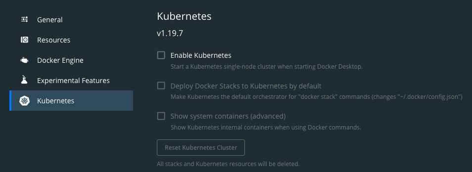

# K8S 101 Challenge

This is a series of hands-on exercices that will help you get into Kubernetes (known by the shorthand 'k8s') and start working on NGINX Ingress Controller.

## Capture the Flag
Of course, if there is a challenge, there will be a winner (I did not mention anything about a prize though)!
Please go and create a user account on [Capture the K8S Flag](http://ctfd.f5demolab.org) and start playing.

Don't worry, you are not alone:
- cheat-sheet: https://github.com/fchmainy/k8s-trainings-101/raw/main/doc/k8s-101-cheatsheet.pdf
- flow diagram: https://github.com/fchmainy/k8s-trainings-101/raw/main/doc/tshoot%20k8s%20pod%20deployment.pdf

For every lab you will find a series of questions that will reward you with points for the correct answer. You can ask for hints, but this will cost you points!

Table of Contents:

    Lab0 - Get familiar with Docker Engine and build your first application
    Lab1 - Get familiar with your k8S Cluster
    Lab2 - Deploy your first application
    Lab3 - Make your application accessible from the outside
    Lab4 - Publish your application with Ingress
    Optional Lab5 - Deploy a new version of the app and manage versioning with Ingress
    Optional Lab6 - East-West or Microservice-to-Microservice traffic

---
## Pre-requisites

Please install on student machines:
- Docker desktop
- Helm
- Git CLI

  
> For Docker Desktop, be sure to enable kubernetes inside docker desktop preferences

In case a student can't install the pre-requisites, there is an UDF BP : https://udf.f5.com/b/8c967d89-dcb3-4788-b41c-1e6a066d3ad5#documentation

---

## Lab0 - Get familiar with Docker Engine and build your first application
### Description

> In this section, we will learn the 3 most important Docker commands in order to build your container image and push this image to your private repository.
> The repository can be a local registry running in your laptop, a github.com registry (public or private), gitlab.com registry or any other that can be accessed
> from the lab environment.

### Useful Commands:

    docker login [OPTIONS] [SERVER]
    docker build
    docker push
    basic git commands

### Lab0 Tasks

**1. Prepare your Gitlab.**  If you don't have a _gitlab.com_ (free) account, please create one (if you have a _github.com_ account already, you can use that to login to _gitlab.com_). We will use _gitlab.com_ as a Source Code Management tool, but mostly, as a private container registry.  Once your account is created:
  - create a new project
  - create a new Deployment token Username and Password (the screen shots below show the steps). Keep the credentials safe, because we will use them in the remaining labs:

 -------
Go to _repositories_ > _Deploy tokens_:

-------
Input your parameters:

-------
Get your credentials:

-------
 &nbsp; 

  - go to container registry (Package & Registry > Container Registry).  You should find a button that outputs the CLI Commands that allow docker to _login_ to your registry, along with the two needed commands to build and push your container image _into_ your registry.  We will use these commands shortly.  For example, your _login_ command will look something like this:

<pre>
docker login <i>registry.gitlab.com</i> -u <i>yourDeployTokenUsername</i>
</pre>
 
 - Now, let's download the application code.  Then build the container image and push _your_ new image to _your_ repository.  Make sure you modify the two _docker_ command examples provided below, to reference your repo, and to append the correct tag and version at the end of them.  Gitlab output these for you previously.
<pre>
git clone https://github.com/fchmainy/k8s-trainings-101.git
cd k8s-trainings-101/v1/
docker build -t registry.gitlab.com<i><b>/YourUser/YourRepo</i>/webapp:v1</b> .
docker push registry.gitlab.com<i><b>/YourUser/YourRepo</i>/webapp:v1</b>
</pre>

 - Finally, verify that the webapp container image is in _your_ registry. Be sure to not only check the image name, but also the image "tag". If you have not correctly tagged the image, you will not see "v1" but "nothing" or "latest". In that case, double check how you flagged the image and correct the issue.

---

## Lab1 - Get familiar with your K8S Cluster
### Description

> The goal of this lab is just to gain an understanding of the main components of a K8S Cluster such as node types, basic networking, the meaning and relationship between Services, Endpoints and Pods.  Use the following commands to output information about your k8s cluster.

### Useful Commands:

    kubectl cluster-info
    kubectl get nodes
    kubectl get namespaces
    kubectl get service -n *namespace*
    kubectl get endpoints -n *namespace*
    kubectl get pods -n *namespace*

### Lab1 Tasks:

Just poke around using the commands above, to understand how the various constructs and components relate to eachother.

> :warning: Don't forget to check [CTFD](http://ctfd.f5demolab.org) to see if there are any challenges or questions for this section.

---

## Lab2 - Deploy your first application
### Description
> The goal of this lab, is to create a namespace (check k8s documentation for more details on namespaces), store your credentials safely and deploy your application container image into Kubernetes.

### Useful Commands:

<pre>
kubectl create ns
kubectl create secret
kubectl apply
</pre>

### Lab2 Tasks:

**1. Modify the YAML Template.** We have prepared an example YAML template file for the Kubernetes deployment manifest, in order to help you create the service and the deployment. Please remember to modify the example so that it matches your requirements.
**2. Deploy your App.**  Now you can prepare for, and deploy your application into your kubernetes cluster:

 - create a namespace called **frontns**
 - create a docker-registry kubernetes secret on registry.gitlab.com using your deploy tokens.
 - deploy the v1_webapp_k8s_manifest.yaml in your **frontns** namespace (verify the manifest file content so it matches your environment).

> :warning: Don't forget to check [CTFD](http://ctfd.f5demolab.org) to see if there are any challenges or questions for this section.

---

## Lab3 - Make application accessible from outside
### Description:
> The goal of this lab is to: 
> - Understand how your application works
> - Understand how to see the application output, while it is still isolated insde Kubernetes.
> - Expose your application to the outside.
> - Find the instructor container registry Deploy Token Username and Password, to gain access to the NGINX image, stored in the instructor private registry.
> - Deploy the NGINX Ingress Controller and create the Ingress Resource.

### Useful Commands:

<pre>
kubectl port-forward 
</pre>

### Lab3 Tasks:

**1. Understand how your application works.**:

<pre>
❯ kubectl get svc -n frontns -l tier=front -l version=v1
NAME     TYPE        CLUSTER-IP    EXTERNAL-IP   PORT(S)   AGE
webapp   ClusterIP   <b>10.1.120.33</b>   none        80/TCP    11m

❯ kubectl describe svc webapp -n frontns
Name:              webapp
Namespace:         frontns
Labels:            tier=front
                   version=v1
Annotations:       <none>
Selector:          app=webapp,version=v1
Type:              ClusterIP
IP:                <b>10.1.120.33</b>
Port:              <unset>  <b>80/TCP</b>
TargetPort:        <b>80/TCP</b>
Endpoints:         <b>10.1.96.49:80</b>
Session Affinity:  None
Events:            <none>

❯ kubectl get ep -n frontns
NAME     ENDPOINTS       AGE
webapp   <b>10.1.96.49:80</b>   13m

❯ kubectl get pods -n frontns -o wide
NAME                      READY   STATUS    RESTARTS   AGE   IP           NODE                                NOMINATED NODE   READINESS GATES
webapp-7dd5ff6788-t8xdt   1/1     Running   0          11m  <b> 10.1.96.49</b>   vmss000000   <none>           <none>
</pre>

**2. Debug your App.** Even though your application is isolated within your Kubernetes cluster, without any external access configured, you can still check if the application is working by running a debug networking pod (praqma/multitool).  This gives you a 'jumphost' container inside Kubernetes: 
<pre>
kubectl create ns <i>debug</i>
kubectl run multitool --image=praqma/network-multitool -n <i>debug</i>
kubectl exec -it multitool -n <i>debug</i> -- bash

bash-5.0# curl webapp.frontns -v
*   Trying <b>10.1.120.33:80</b>...
* Connected to <b>webapp.frontns</b> (<b>10.1.120.33) port 80</b> (#0)
</pre>

**3. Expose your App.**  The next step is to expose your application to the outside world.  There are many ways to do this, first and foremost the **port-forward** which is mainly used for troubleshooting, as it is not permanent.
Port Forwarding can be applied to the Service, Deployment, Pods... it really depends what you want to debug.  In this example, we will expose the Service (remember to check for corresponding flags on CTFD):  

<pre>
- create a port-forward to your **webapp deployment** redirecting TCP port 5000 to TCP/80.
- curl http://127.0.0.1:5000
</pre>

 - You should now be able to access your webapp (v1) web page:

	

 - You will find, on the presented V1 web page, the instructor gitlab Deploy Token Username and Password. Keep these credentials safe, you will need them in the next lab.

Note:
<i>You can also expose your application using the expose service object and access your application via a NodePort. This is a permanent change (until you explicitly remove it) so we won't use it here as we prefer using an Ingress service. Expose is presented here: https://kubernetes.io/docs/tutorials/stateless-application/expose-external-ip-address/</i>

> :warning: Don't forget to check [CTFD](http://ctfd.f5demolab.org) to see if there are any challenges or questions for this section.

---

## Lab4 - Publish your application with Ingress
### Description
> The goal of this lab is to create an Ingress Resource to access the webapp (v1) application.  Before we can do this, we need to install NGINX Ingress Controller into our Kubernetes cluster.

> In the real world, the testing, validation, building and release of an application _should_ be automated as part of a CI/CD pipeline. We are going to manually step through part of this process, to understand the advanced routing capabilities of our NGINX Ingress services in delivering applications that are deployed into Kubernetes.

> :warning: Don't forget to check [CTFD](http://ctfd.f5demolab.org) to see if there are any challenges or questions for this section.

### Lab4 Tasks:

The most common method used to access Kubernetes services from the outside world, is deployment of an Ingress resource.  To do this, we first need to install an Ingress Controller.  We have several options for Ingress Controller, but we will use NGINX for this lab.

**1. Preparation.**  Using the instructor private registry deployment token username and password: 
 - create a namespace called **ingress**
 - create a docker-registry secret in the **ingress** namespace using the instructor deploy username/password tokens. 

**2. Get the Helm Chart for NGINX.**  There are multiple ways we can install the NGINX Kubernetes Ingress Controller:
 * [using manifests](https://docs.nginx.com/nginx-ingress-controller/installation/installation-with-manifests/)
 * [using helm](https://docs.nginx.com/nginx-ingress-controller/installation/installation-with-helm/)
 * [using operator](https://docs.nginx.com/nginx-ingress-controller/installation/installation-with-operator/)

 - In this lab we will use the Helm deployment mode, as it is the simplest way to install _all_ the components (Service Accounts, CRDs, etc.) required for a complex deployment.  Please type the following commands to install the latest NGINX Ingress Helm chart.

<pre>
<b>helm repo list</b>
Error: no repositories to show

<b>helm repo add nginx-stable https://helm.nginx.com/stable</b>
"nginx-stable" has been added to your repositories

<b>helm repo update</b>
Hang tight while we grab the latest from your chart repositories...
...Successfully got an update from the "nginx-stable" chart repository
Update Complete. ⎈Happy Helming!⎈

<b>helm repo list</b>
NAME            URL
nginx-stable    https://helm.nginx.com/stable
</pre>

**3. Deploy NGINX Ingress Controller using Helm.**  Now, we are going to deploy the NGINX Plus Ingress and all of the required components in a single, multi-line command:
<pre>
helm install nginx-ingress nginx-stable/nginx-ingress \
--namespace <b>ingress</b> \
--set controller.kind=<b>deployment</b> \
--set controller.replicaCount=<b>2</b> \
--set controller.nginxplus=<b>true</b> \
--set controller.appprotect.enable=<b>true</b> \
--set controller.image.repository=<b>registry.gitlab.com/f.chmainy/nginx</b> \
--set controller.image.tag=<b>v1.10.0</b> \
--set controller.service.type=NodePort \
--set controller.service.httpPort.nodePort=30274 \
--set controller.service.httpsPort.nodePort=30275 \
--set controller.serviceAccount.imagePullSecretName=<b>regcred</b> \
--set controller.ingressClass=<b>ingressclass1</b>
</pre>

**4. Create Ingress Resource.**. Now that you have installed the Ingress Controller into the **ingress** namespace, you can move on to deploy the Ingress Resource to access your application.  Ingress Resources must be deployed into the application namespaces.  For reference, there is a great example on the official [NGINX INC Github Repository](https://github.com/nginxinc/kubernetes-ingress/tree/master/examples-of-custom-resources/basic-configuration)

 - In the web application namespace (frontns), you should now deploy the Ingress Resource matching the Ingress Class specified when you deployed the Ingress Controller:
 
<pre>
apiVersion: k8s.nginx.org/v1
kind: VirtualServer
metadata:
  name: k8s101ingress
spec:
  ingressClassName: ingressclass1
  host: www.mycompany.com
  upstreams:
  - name: v1
    service: webapp
    port: 80
  routes:
  - path: /
    action:
      proxy:
        upstream: v1
</pre>

 - You should now be able to access your v1 application using your web browser at http://www.mycompany.com:30274

> :warning: Ingress is a 'shared' model, and it is therefore expected to provide access to many applications.  The Ingress Resource 'spec' you deployed instructs NGINX to use the Host header 'www.mycompany.com' to identify requests for your application requests and steers them to your webapp containers.  This means that any request to the Ingress must include the correct Host Header.  

Note:
<i>if you are using the UDF blueprint, the www.mycompany.com:30274 fqdn should already be registered in the jumpHost hosts file.</i>

---

## Optional Lab5 - Deploy a new version of the app and manage versioning with Ingress
### Description
> The goal of this lab is to deploy version 2 (v2) of the web application, and then configure Ingress to provide access to it.  You will use two different deployment Strategies:
>  - Canary Realease
>  - A/B Testing

### Lab5 Tasks:

There are multiple deployment strategies to choose, when releasing a new application version:
- A/B Testing
- Canary Testing
- Blue/Green

They are all variations on the same theme, which is to test the new version of the application, with a subset of users, and continue to send all other users to the oiriginal version.  The aim is to minimise the risk of testing the new version of the application, by only exposing a small number of users to it.

The decision on which strategy to employ comes down to what you want to achieve and who/what is testing the application.  For reference, you can find some external documentation on this subject here: https://docs.flagger.app/usage/deployment-strategies

**1. Build and deploy the version 2 (v2) of your application.** A new version of your application has been developed and is ready to be released. 

 - First, you must build and push the v2 front container image into your private container image registry.
<pre>
<b>
cd ../v2/front/
docker build -t registry.gitlab.com/f.chmainy/toremove/webapp:v2 .
docker push registry.gitlab.com/f.chmainy/toremove/webapp:v2
</b>
</pre>

 - Then, you can use the kubernetes manifest of the application to deploy the Ingress Resource.
<pre>
<b>kubectl apply -f v2/front/v2_webapp_k8s_manifest.yaml -n frontns</b>
service/webappi-v2-svc configured
deployment.apps/webapp-v2-dep configured
</pre>

        

   Note: In a large scale cluster, you probably won't have a clear mapping of services names, deployments, endpoints and pods, this is why labels could be very useful:

<pre>
<b>kubectl get svc --all-namespaces -l application=k8s101,version=v1,tier=front</b>
NAMESPACE   NAME     TYPE        CLUSTER-IP       EXTERNAL-IP   PORT(S)   AGE
frontns     webapp   ClusterIP   10.103.125.244   <none>        80/TCP    53m

<b>kubectl get svc --all-namespaces -l application=k8s101,version=v2,tier=front</b>
NAMESPACE   NAME             TYPE        CLUSTER-IP      EXTERNAL-IP   PORT(S)   AGE
frontns     webappi-v2-svc   ClusterIP   10.110.131.55   <none>        80/TCP    56m
</pre>

**2. Configure Ingress with A/B Testing.** Here, we want to split part of the traffic (%) to the new version so we can validate and measure the proper function of the new version without impacting too many customers if there were any issues with the code.

 - Here we are doing a 80% to v1 and 20% to v2, in real life the cursor would be progressively moving out to v2 until final approval.  Deploy an updated A/B Ingress Resource:

[link to documentation](https://docs.nginx.com/nginx-ingress-controller/configuration/virtualserver-and-virtualserverroute-resources/#split)

<pre>
apiVersion: k8s.nginx.org/v1
kind: VirtualServer
metadata:
  name: k8s101ingress
spec:
  ingressClassName: ingressclass1
  host: www.mycompany.com
  upstreams:
  - name: v1
    service: webapp
    port: 80
  - name: v2
    service: webapp-v2-svc
    port: 80
  routes:
  - path: /
    splits:
    - weight: <b>80</b>
      action:
        pass: v1
    - weight: <b>20</b>
      action:
        pass: v2
</pre>

**3. Configure Ingress with Canary testing.**  In this scenario, we are only steering specific key users (dev, test users, for example) to the new version of the application, by detecting the presence of a specific header or cookie.  Deploy an updated Canary Ingress Resource:

[link to documentation](https://docs.nginx.com/nginx-ingress-controller/configuration/virtualserver-and-virtualserverroute-resources/#match)

<pre>
apiVersion: k8s.nginx.org/v1
kind: VirtualServer
metadata:
  name: k8s101ingress
spec:
  ingressClassName: ingressclass1
  host: www.mycompany.com
  upstreams:
  - name: v1
    service: webapp
    port: 80
  - name: v2
    service: webapp-v2-svc
    port: 80
  routes:
  - path: /
    matches:
    - conditions:
      - cookie: <b>flag6</b>
        value: <b>COOKIE_VALUE6</b>
      action:
        pass: v2
    action:
      pass: v1
</pre>

 - Using chrome and go to the Developer tools / Console, you can inject the required cookie:
<pre>
document.cookie="flag6=COOKIE_VALUE6; expires=Mon, 2 Aug 2021 20:20:20 UTC; path=/";
</pre>

 - Now we can redirect the whole Ingress traffic to the v2 frontend, remove the v1 webapp Ingress rules and remove the v1 application:
<pre>
apiVersion: k8s.nginx.org/v1
kind: VirtualServer
metadata:
  name: k8s101ingress
spec:
  ingressClassName: ingressclass1
  host: www.mycompany.com
  upstreams:
  - name: v2
    service: webapp-v2-svc
    port: 80
  routes:
  - path: /
    action:
      proxy:
        upstream: v2
</pre>

Note:
For reference, there are many examnples of advanced routing here: https://github.com/nginxinc/kubernetes-ingress/tree/master/examples-of-custom-resources

---

## Optional Lab6 - East-West or Microservice-to-Microservice traffic
### Description
> The goal of this lab is to deploy the backend service, and then access your application to capture the flag!!!

### Tasks:
**1. Deploy the Back-End.**  The backend is a very basic JSON RESTFUL API service that delivers an UUID based on a cookie provided by the frontend.
 - create a new namespace called <b>backendns</b> where the backend pod will reside.
 - build the container image from the provided Dockerfile and push it to your private container registry.
 - deploy the new application service (service + deployment) to the backendns namespace.

**2. Check the application.** Access the v2 application and try accessing the application by inserting a cookie in your web browser:
<pre>
document.cookie="flag6=COOKIE_VALUE8; expires=Mon, 2 Aug 2021 20:20:20 UTC; path=/";
</pre>

You will find the CTF flag in the response page.

 **...then you win!!!**
